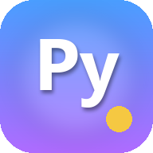

# PyPath — Learn Python

A mobile-friendly, Duolingo-style coding app. Bite-sized Python lessons, interactive
drills, a live in-browser playground, boss fights at the end of each unit, and a
pet mascot that grows with your XP.



## Features

- **35 units · 188 lessons · 3,000+ drill cards** — from "what is a variable?" to
  packaging, FastAPI, and async.
- **10 card types** — concept, code example, multiple choice, predict-the-output,
  tap-to-fill, fill-in, reorder, bug-fix, multi-select, free-typed output.
- **Boss fights** — end-of-unit 10-question mixed-review quiz. 5-minute timer,
  80% to pass, misses route straight into the Practice drill queue.
- **Pet mascot** — floating Kirby-ish buddy, levels with XP, wilts if you skip days,
  evolves at milestones 🐣 → 🐥 → 🦆 → 🦚 → 🐲 → 🔥.
- **Constellation map** — every lesson is a star; completed stars light up, units
  form constellations, bosses glow at the center.
- **Code Diff game** — starts you from working code with a "change it so X" goal;
  runs live in-browser via Pyodide.
- **Weakness-aware Practice** — any question you miss lands in a drill queue.
  Each card has a "🔁 More like this" pill that spins up 5 pattern-matched sibling
  questions.
- **Live playground** — Python (via Pyodide), JavaScript, HTML/CSS — all run in
  the browser, no backend.
- **AI Tutor** — ask, summarise, ELI5, quiz-me, real-world example.
- **Offline-friendly PWA** — full PNG icon set, Web App Manifest, add to home
  screen on iOS/Android.

## Stack

Pure HTML + CSS + vanilla JS — no build step, no framework. Drop it on any static
host.

- [`lessons.js`](lessons.js) — all curriculum content (CURRICULUM array).
- [`courses.js`](courses.js) — multi-course scaffolding (Python is the built-out one).
- [`app.js`](app.js) — everything else: reader, boss, pet, games, AI, state.
- [`styles.css`](styles.css) — the single stylesheet.
- [`index.html`](index.html) — entry point.

## Run it locally

```bash
# any static server will do
python -m http.server 8000
# then open http://localhost:8000
```

## Regenerate icons

```bash
pip install Pillow
python make_icon.py
```

## Roadmap

Ideas that are half-sketched in the code:

- Spaced repetition on weaknesses (SM-2 style).
- Python Tutor-style stack-frame stepper (prototype in
  [`stepper-demo.html`](stepper-demo.html)).
- Duolingo-style weekly leagues.
- Anki-deck exporter.

## License

MIT — build, fork, remix freely.
